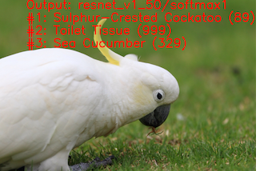
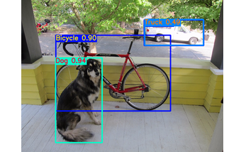
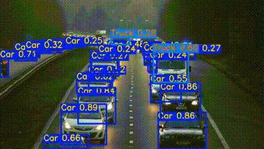
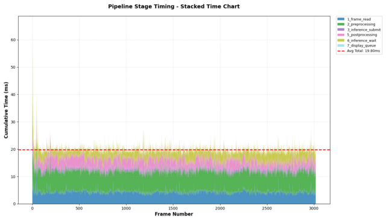
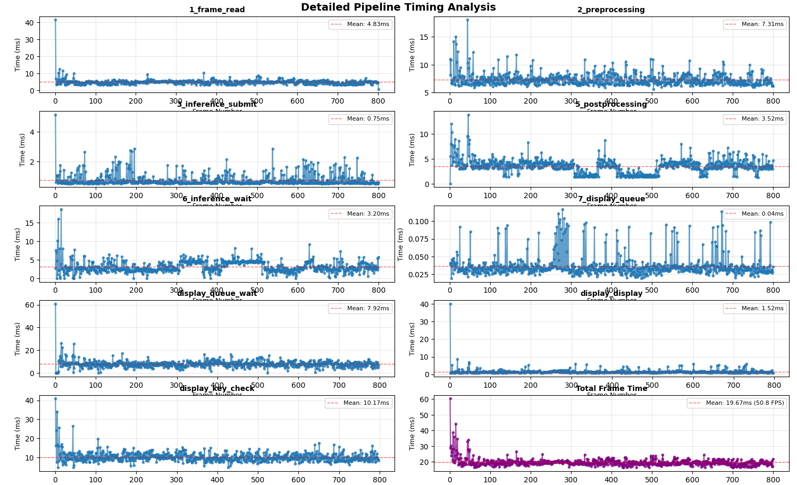

# Hailo Inference Pipeline






A comprehensive Python implementation for deploying deep learning models on Hailo hardware accelerators with support for both synchronous and asynchronous inference operations.

## Overview

This inference pipeline provides a robust and production-ready framework for running neural network inference on Hailo AI accelerators. It features sophisticated error handling, performance profiling, and support for various post-processing operations including object detection and image classification.

The pipeline is designed to handle both single images and video streams with real-time processing capabilities, making it suitable for production deployment scenarios.

## Features

### Core Capabilities

- **Dual Inference Modes**: Support for both synchronous and asynchronous inference
- **Robust Exception Handling**: Hailo-specific exception handling with proper error recovery
- **Performance Profiling**: Built-in profiling with detailed timing statistics and visualization
- **Multi-threaded Display**: Asynchronous frame display for smooth video playback
- **Context Manager Support**: Safe resource management with automatic cleanup

### Supported Post-Processing

- **Image Classification**: Top-N classification results with ImageNet labels
- **Object Detection**: YOLOv8-style detection with NMS on host
- **Palm Detection**: Specialized hand/palm detection with custom anchors

### Performance Features

- **Zero-Copy Operations**: Efficient buffer management to minimize memory overhead
- **Pipeline Visualization**: Stacked timing charts and detailed performance breakdowns
- **Multi-Thread Profiling**: Separate thread visualization in Perfetto traces (Main + Display threads)
- **Perfetto Trace Export**: Industry-standard trace format for advanced performance analysis
- **Hardware Scheduling**: Configurable scheduling algorithms (Round Robin)

## Requirements

### Hardware

- Hailo AI accelerator (Hailo-8, Hailo-8L, or compatible device)
- PCIe interface connection

### Software Dependencies

```bash
# Hailo SDK
hailo-platform>=4.0.0

# Core dependencies
opencv-python
matplotlib

# Additional utilities (included in repository)
- inference_utils (DisplayThread, FrameReaderThread, PerformanceProfiler)
- postprocess modules (classification, nms_on_host, palm_detection)
```

### Python Version

- Python 3.8 or higher

## Installation

1. Install HailoRT following the official documentation
2. Install Python dependencies:

```bash
# It is recommended to use an OpenCV 3.x version that matches the numpy version required by HailoRT.
# For example:
pip install opencv-python==3.4.18.65 matplotlib
```

3. Ensure the Hailo device is properly connected and recognized:

```bash
hailortcli fw-control identify
```

## Usage

### Basic Usage

#### Image Classification

```bash
python inference.py image.jpg \
    --net ./hefs/resnet_v1_50.hef \
    --postprocess classification
```

#### Object Detection (Video)

```bash
python inference.py video.mp4 \
    --net ./hefs/yolov8n.hef \
    --postprocess nms_on_host \
    --config ./configs/yolov8.json
```

#### Asynchronous Inference with Profiling

```bash
python inference.py video.mp4 \
    --net ./hefs/resnet_v1_50.hef \
    --postprocess classification \
    --profile
```

#### Performance Profiling with Perfetto Trace Export

```bash
python inference.py video.mp4 \
    --net ./hefs/resnet_v1_50.hef \
    --postprocess classification \
    --profile \
    --trace trace.json
```

#### Synchronous Inference

```bash
python inference.py image.jpg \
    --net ./hefs/resnet_v1_50.hef \
    --postprocess classification \
    --synchronous
```

### Command Line Arguments

| Argument        | Short | Type       | Default                   | Description                                                              |
| --------------- | ----- | ---------- | ------------------------- | ------------------------------------------------------------------------ |
| `images`        | -     | positional | required                  | Path to image or video file to process                                   |
| `--net`         | `-n`  | string     | `./hefs/resnet_v1_50.hef` | Path to HEF model file                                                   |
| `--postprocess` | `-p`  | choice     | `classification`          | Post-processing type: `classification`, `nms_on_host`, `palm_detection`  |
| `--config`      | `-c`  | string     | auto-detected             | Path to custom JSON configuration file for post-processing               |
| `--synchronous` | `-s`  | flag       | false                     | Use synchronous inference on HRT 4.X (default: asynchronous)             |
| `--callback`    | -     | flag       | false                     | Use callback mode with async inference                                   |
| `--batch-size`  | `-b`  | integer    | 1                         | Number of images per batch                                               |
| `--profile`     | -     | flag       | false                     | Enable performance profiling with visualization                          |
| `--trace`       | -     | string     | none                      | Export profiling data to Perfetto trace JSON file (requires `--profile`) |

### Configuration Files

The pipeline uses JSON configuration files for post-processing:

- **Classification**: `./configs/class_names_imagenet.json`
- **YOLOv8 Detection**: `./configs/yolov8.json`
- **Palm Detection**: `./configs/palm_detection_full.json`

Example configuration structure:

```json
{
    "classes": ["class1", "class2", ...],
    "confidence_threshold": 0.5,
    "nms_threshold": 0.45
}
```

## Synchronous vs Asynchronous Inference

### Synchronous Inference (`--synchronous`)

**Characteristics:**

- Blocking operations: each inference waits for completion before proceeding
- Simpler execution flow with sequential processing
- Lower latency for single-frame processing
- Easier to debug and understand

**Best For:**

- Single image processing
- Batch processing where order matters
- Development and debugging
- Applications where simplicity is preferred over throughput

**Performance:**

```
Frame → Preprocess → [Inference] → Postprocess → Display
         (wait)                       (wait)
```

### Asynchronous Inference (default)

**Characteristics:**

- Non-blocking operations: submit inference and continue processing
- Pipelined execution with overlapped operations
- Higher throughput for video streams
- More complex error handling

**Best For:**

- Real-time video processing
- High-throughput applications
- Production deployments
- Applications requiring maximum FPS

**Performance:**

```
Frame 1 → Preprocess → Submit Inference
Frame 2 → Preprocess → Submit Inference ────────────┐
Frame 3 → Preprocess → Submit Inference ──────┐     │
                                              │     │
                                Postprocess Frame 1 & Wait Frame 2 inference
                                              │
                                Postprocess Frame 2 & Wait Frame 3 inference
```

### Performance Comparison

| Metric                    | Synchronous | Asynchronous |
| ------------------------- | ----------- | ------------ |
| Single Image Latency      | Low         | Medium       |
| Video Throughput (FPS)    | Medium      | High         |
| CPU Utilization           | Lower       | Higher       |
| Implementation Complexity | Simple      | Complex      |
| Resource Usage            | Lower       | Higher       |

### Example performance measurements

The following table shows measured performance on a 3019-frame video input for different models, comparing asynchronous and synchronous inference modes. (Measured with RaspberryPi5 + Hailo AI-HAT/Hailo-8)

| Model               | Asynchronous FPS | Synchronous FPS | Post-processing time (ms) |
| ------------------- | ---------------- | --------------- | ------------------------- |
| Palm_detection_full | 51.66 fps        | 62.02 fps       | 2.72 ms                   |
| Yolov8n             | 74.33 fps        | 65.96 fps       | 0.560 ms                  |
| resnet_v1_50        | 72.17 fps        | 68.81 fps       | 0.497 ms                  |

### Callback Mode (`--callback`)

Available only in asynchronous mode, callback mode processes results immediately upon completion:

```bash
python inference.py video.mp4 \
    --net ./hefs/yolov8n.hef \
    --postprocess nms_on_host \
    --callback
```

**Benefits:**

- Reduced latency by processing results immediately
- Better suited for real-time applications
- Automatic result handling

## Performance Profiling

Enable profiling with `--profile` to get detailed timing statistics:

```bash
python inference.py video.mp4 --net ./hefs/resnet_v1_50.hef --profile
```

### Profiling Output

**Console Statistics:**

```
======================================================================================
PERFORMANCE PROFILING RESULTS
======================================================================================
Checkpoint                     Count      Min(ms)      Max(ms)     Mean(ms)   Var(ms²)
--------------------------------------------------------------------------------
1_frame_read                     300        0.125        2.456        0.234      0.012
2_preprocessing                  300        1.234        3.456        1.567      0.045
3_inference_submit               300        0.089        0.234        0.123      0.003
4_inference_wait                 300       15.234       18.456       16.234      1.234
5_postprocessing                 300        2.345        4.567        2.789      0.234
6_display_queue                  300        0.012        0.456        0.034      0.001
total_frame_time                 300       19.567       25.678       21.234      3.456
======================================================================================

Average Frame Processing Time: 21.234 ms
Average FPS (from frame time): 47.09
======================================================================================
```

**Visual Charts:**

- **Stacked Time Chart**: Shows cumulative timing for each pipeline stage across frames



- **Detailed Timing Chart**: Individual timing plots for each stage with mean lines



### Perfetto Trace Export

Export profiling data to Perfetto's trace event format for advanced timeline visualization:


```bash
python inference.py video.mp4 \
    --net ./hefs/resnet_v1_50.hef \
    --profile \
    --trace trace.json
```

**Output:**

```
Perfetto trace exported to: trace.json
Total frames: 300
Total events: 1803
Threads: Main Thread, Display Thread

Visualize the trace at:
  - Chrome: chrome://tracing
  - Perfetto UI: https://ui.perfetto.dev
```

**Viewing the Trace:**

1. **Chrome Tracing Tool**:
   - Open Chrome browser
   - Navigate to `chrome://tracing`
   - Click "Load" and select your trace file
   - Use WASD keys to navigate the timeline

2. **Perfetto UI** (recommended):
   - Visit https://ui.perfetto.dev
   - Click "Open trace file" and select your trace file
   - Explore the interactive timeline with advanced features

**Multi-Thread Visualization:**

The trace shows events across **up to three separate thread rows** (depending on configuration):

**Main Thread (tid: 1)**

- Frame processing pipeline: `frame_read`, `preprocessing`, `inference_submit`, `inference_wait`, `postprocessing`
- Frame markers showing processing boundaries
- Queue operations: `display_queue` (sending frames to display thread)

**Capture Thread (tid: 3)** (video mode only)

- Asynchronous frame capture running in parallel
- `read`: Time to read frame from video source (`cv2.VideoCapture.read`)
- `queue_put`: Time to queue frame for main thread processing

**Display Thread (tid: 2)** (video mode only)

- Asynchronous display operations running in parallel
- `queue_wait`: Time waiting for frames from main thread
- `display`: OpenCV rendering time (`cv2.imshow`)
- `key_check`: Keyboard input polling time

This separation allows you to:

- **See true parallelism**: Visualize when all threads run concurrently
- **Identify I/O bottlenecks**: Determine if video reading is slow (capture thread)
- **Find processing bottlenecks**: Determine if main thread or display thread is limiting performance
- **Analyze queue behavior**: See if threads are starved or if frames are backing up
- **Understand complete pipeline**: End-to-end visibility of capture → process → display

**Benefits of Perfetto Trace:**

- **Timeline Visualization**: See exact execution timeline of each pipeline stage across both threads
- **Frame Boundaries**: Visual markers showing where each frame starts
- **Duration Events**: Color-coded bars showing how long each stage took
- **Zoom & Pan**: Interactive exploration of timing data
- **Performance Analysis**: Identify bottlenecks and timing patterns across threads
- **Professional Format**: Industry-standard trace format used by Chrome, Android, and more
- **Thread Insights**: Understand parallelism, blocking, and synchronization

**What You'll See:**

```
┌─────────────────────────────────────────────────────┐
│ Hailo Inference Pipeline                            │
├─────────────────────────────────────────────────────┤
│ Main Thread                                         │
│ ┌─┬────┬────┬───┬────────┬────┬──┐                  │
│ │●│read│prep│inf│inf_wait│post│q │ Frame 1          │
│ └─┴────┴────┴───┴────────┴────┴──┘                  │
│   ┌─┬────┬────┬───┬────────┬────┬──┐                │
│   │●│read│prep│inf│inf_wait│post│q │ Frame 2        │
│   └─┴────┴────┴───┴────────┴────┴──┘                │
├─────────────────────────────────────────────────────┤
│ Capture Thread                                      │
│ ┌────┬──┐                                           │
│ │read│qp│ Frame 1                                   │
│ └────┴──┘                                           │
│     ┌────┬──┐                                       │
│     │read│qp│ Frame 2                               │
│     └────┴──┘                                       │
├─────────────────────────────────────────────────────┤
│ Display Thread                                      │
│   ┌────┬───────┬────┐                               │
│   │wait│display│ key│ Frame 1                       │
│   └────┴───────┴────┘                               │
│        ┌────┬───────┬────┐                          │
│        │wait│display│ key│ Frame 2                  │
│        └────┴───────┴────┘                          │
└─────────────────────────────────────────────────────┘
```

- Each checkpoint appears as a duration bar on the timeline
- Frame markers indicate processing boundaries
- Sequential execution flow is visually clear across threads
- Easy to spot timing variations and bottlenecks
- Metadata includes frame numbers and stage names

**Typical Analysis Use Cases:**

1. **Bottleneck Identification**: See which stage takes longest on which thread
2. **I/O Performance**: Check if video capture (Capture Thread) is slow
3. **Parallelism Validation**: Verify all threads run while others process
4. **Queue Health**: Check if threads wait too long (starved) or run constantly (bottleneck)
5. **Frame Variance**: Compare timing across frames to spot anomalies
6. **End-to-End Latency**: Measure complete frame processing time from capture to display

## Exception Handling

The pipeline implements robust exception handling for production environments:

### Exception Types

| Exception                | Description                    | Recovery Action      |
| ------------------------ | ------------------------------ | -------------------- |
| `InferenceTimeoutError`  | Inference operation timed out  | Retry frame or skip  |
| `InferenceSubmitError`   | Failed to submit inference job | Break (device error) |
| `InferenceWaitError`     | Failed to retrieve results     | Retry or skip frame  |
| `InferencePipelineError` | Synchronous inference failed   | Break (fatal)        |

### Error Recovery Example

```python
try:
    outputs = infer.inference(dataset)
    results = infer.wait_and_get_output()
except InferenceTimeoutError as e:
    # Timeout is recoverable - retry or skip frame
    print(f"Timeout on frame {frame_count}: {e}")
    continue
except InferenceSubmitError as e:
    # Device error - stop processing
    print(f"Device error: {e}")
    break
```

## Video Controls

When processing video files:

- **Press 'q'**: Quit the application
- **Close window**: Stop processing

## Output

### Classification Output

```
Top 3 predictions:
1. Egyptian cat (0.8756)
2. Tabby cat (0.0234)
3. Tiger cat (0.0123)
```

### Detection Output

- Bounding boxes drawn on frame
- Class labels with confidence scores
- Real-time FPS counter

### Performance Summary (video mode only)

```
================================================================================
BASIC PERFORMANCE SUMMARY
================================================================================
Total execution time: 12.345678 seconds
Total frames processed: 300
Overall throughput: 24.31 FPS
================================================================================
```

## Troubleshooting

### Common Issues

**1. "No input streams found in the model"**

- Verify HEF file path is correct
- Ensure HEF file is compatible with your Hailo device

**2. "Inference device not ready: timeout"**

- Check Hailo device connection: `hailortcli fw-control identify`
- Ensure no other processes are using the device

**3. "Failed to initialize InferPipeline"**

- Install Hailo SDK properly
- Check device permissions: `sudo chmod 666 /dev/hailo0`
- Verify PCIe connection

**4. Low FPS performance**

- Use asynchronous mode (default)
- Disable profiling for production
- Increase `max_queue_size` in DisplayThread
- Use hardware-accelerated video decoding

### Debug Mode

For detailed debugging, the pipeline prints comprehensive error messages:

```python
# Each exception includes:
# - Error type and description
# - Frame number where error occurred
# - Suggested recovery action
# - Original exception chain
```

## Architecture

### Pipeline Flow

**Single Image Mode:**

```
Input (Image)
    ↓
Frame Reading (synchronous)
    ↓
Preprocessing (resize, pad, color conversion)
    ↓
Inference (Hailo device)
    ↓
Postprocessing (NMS, classification, etc.)
    ↓
Display (synchronous)
```

**Video Mode (Multi-threaded):**

```
Capture Thread:          Main Thread:              Display Thread:
Frame Reading      →     Preprocessing       →     Frame Display
(FrameReaderThread)      ↓                         (DisplayThread)
     ↓                   Inference                       ↓
  Queue Buffer           (Hailo device)             Queue Buffer
                         ↓
                    Postprocessing
                         ↓
                    Performance Profiling
                       (optional)
```

**Key Features:**

- **Capture Thread**: Asynchronously reads frames from video file
- **Main Thread**: Processes frames through inference pipeline
- **Display Thread**: Asynchronously displays results
- **All three threads run in parallel for maximum throughput**

### Class Structure

- **`InferPipeline`**: Main inference manager
  - Handles device initialization
  - Manages synchronous/asynchronous inference
  - Implements robust exception handling

- **`FrameReaderThread`**: Asynchronous frame capture (video mode)
  - Non-blocking video frame reading
  - Queue buffering (default: 4 frames)
  - Parallel I/O with main processing
  - Thread-specific performance profiling (when enabled)

- **`DisplayThread`**: Asynchronous frame display (video mode)
  - Non-blocking video output
  - Queue management with frame dropping
  - User interaction handling
  - Thread-specific performance profiling (when enabled)

- **`PerformanceProfiler`**: Timing and statistics
  - Per-stage timing measurement across multiple threads
  - Statistical analysis with variance calculations
  - Matplotlib visualization (stacked and detailed charts)
  - Perfetto trace export with multi-thread support

### Model Attribution

- The palm detection model used in this project is from Google MediaPipe: [MediaPipe Models](https://github.com/google-ai-edge/mediapipe/blob/master/docs/solutions/models.md)
- The post-processing code for the MediaPipe model is adapted from [blaze_app_python](https://github.com/AlbertaBeef/blaze_app_python/tree/main)

## Additional Documentation

For more detailed information about specific features:

- **[FRAMEREADER_INTEGRATION.md](./doc/FRAMEREADER_INTEGRATION.md)**: FrameReaderThread integration details
  - How asynchronous frame capture works
  - Performance benefits and comparison
  - Queue configuration and tuning
  - Thread lifecycle and error handling

- **[DISPLAY_THREAD_TIMING.md](./doc/DISPLAY_THREAD_TIMING.md)**: Technical details about multi-thread profiling implementation
  - Display Thread and Capture Thread profiling
  - Thread-safe timing data collection
  - How timing data flows between threads
  - Implementation notes and performance impact

- **[PERFETTO_VISUALIZATION_GUIDE.md](./doc/PERFETTO_VISUALIZATION_GUIDE.md)**: Complete guide to using Perfetto traces
  - Visual examples of multi-thread timeline view (Main, Capture, Display)
  - How to interpret the trace data
  - Common patterns and what they mean
  - Analysis tips and real-world examples
  - Interactive features and navigation

## About Jupyter Notebooks

This project includes a reference Jupyter notebook that demonstrates:

- How to build a HEF (Hailo Executable Format) file from a MediaPipe TFLite model

This makes it easier to convert and optimize MediaPipe models for use with Hailo hardware acceleration.

To use the notebook:

1. Open it in Jupyter Lab or Jupyter Notebook
2. Follow the step-by-step instructions of DFC notebook to convert your TFLite model to HEF format
3. Use the generated HEF file with the main inference script

## Known issues

Exception handling has not been validated.

## Device-specific limitations

Some Hailo devices do not support synchronous inference API (`--synchronous`), for example, Hailo-10.  
On such devices, use the default asynchronous inference mode instead.

## License

This project is provided as-is for use with Hailo hardware accelerators.
Please refer to the Hailo SDK license for terms and conditions regarding the use of Hailo software and hardware.

This software is licensed under the Apache License 2.0 - see the LICENSE file for details.

### Third-Party Licenses

- OpenCV: Apache 2.0 License
- NumPy: BSD License
- Matplotlib: PSF-based License

---

**Version**: 1.4.0  
**Last Updated**: 2026-02-12  
**Hailo SDK Compatibility**: 4.0+

**What's New in 1.4.0:**

- Multi-thread profiling with Perfetto trace export
- FrameReaderThread enabled for asynchronous frame capture in video mode
- Display thread timing measurements
- Capture thread (FrameReaderThread) timing measurements
- Up to three separate thread views in Perfetto UI (Main, Capture, Display)
- True three-way parallelism: Capture → Process → Display
- Enhanced performance analysis capabilities
